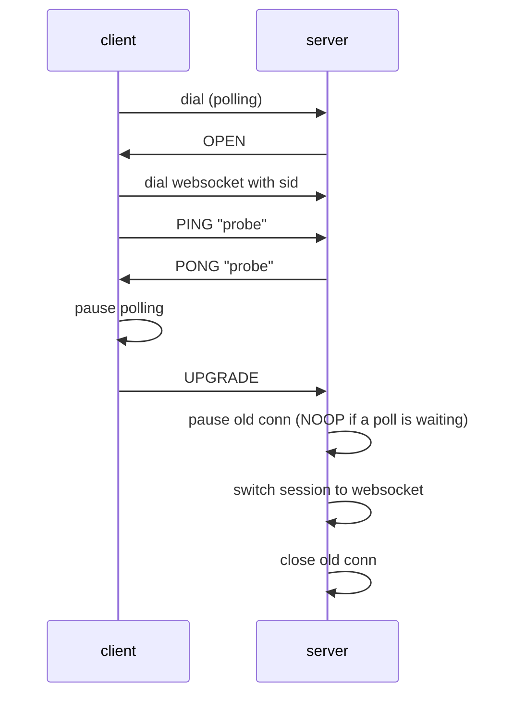

# Protocol support

This file owns the protocol facts: what the current code implements, known deviations,
and the deltas planned for v2. Client version compatibility is summarised in
[README.md](../README.md#compatibility).

## Implemented: Engine.IO protocol v3

Package `engineio`.

- Query parameter `EIO` is not checked; the server behaves as protocol v3 regardless.
- Transports: `polling` (XHR only; the `j` JSONP parameter and the `b64` parameter are
  ignored, as in Engine.IO v4) and `websocket` (`gorilla/websocket`). Order and upgrade path come from `engineio.Options.Transports`,
  default `[polling, websocket]`.
- Handshake (`OPEN` packet) carries `sid`, `upgrades`, `pingInterval` (default 20 s),
  `pingTimeout` (default 60 s). There is no `maxPayload`.
- Heartbeat: the client sends `PING` (`2`), the server answers `PONG` (`3`) and extends
  the read/write deadline by `pingTimeout`.
- Polling payload (Engine.IO v4 framing, ahead of the rest of this section): packets are
  separated by the record separator `0x1e`; binary packets are base64 behind a `b`
  prefix; every body is `text/plain; charset=UTF-8`, and a POST of `application/octet-stream`
  is HTTP 400. A POST body is read up to the transport's `MaxPayload` (default 1 MiB,
  `polling.Transport.MaxPayload`) before it is decoded: an announced or actual size over it is
  HTTP 413 and delivers nothing; a malformed body is HTTP 400, delivers nothing and ends
  the session. The server does not limit its responses: a response carries every packet the
  session writers hand over at once. The Go client reads a response (and the open
  response) up to the same `MaxPayload`; a longer one fails the session with
  `payload.ErrTooLarge`, which readers see. The client batches its POSTs up to the
  `maxPayload` of the open packet. Sessions are looked up by `sid`; an unknown `sid` is HTTP 400.
  The handshake, heartbeat and `EIO` check of this section are still v3 until the
  rest of 2.1 lands; the heading of this section flips with that change.
- Upgrade polling → websocket:

  Implemented in `session.Session.upgrading`. If the client never sends `UPGRADE`, the
  paused polling connection is resumed.
- Error responses are plain text with HTTP 400 (bad transport, bad sid) or 502
  (request checker or transport accept failure).

## Implemented: Socket.IO protocol v4

Package `parser` on `master`, and the root package on branch `v1.x`. Stage 2.0 removed the
v1 root runtime from `master`: the server behaviour below (root namespace, event
acknowledgement, namespace query handling and the deviations) is implemented on `v1.x`
only, and `master` keeps the packet codec in `parser`.

- Packet format `<type>[<attachments>-][<namespace>,][<ack id>][JSON]`. Types
  0 CONNECT, 1 DISCONNECT, 2 EVENT, 3 ACK, 4 ERROR, 5 BINARY_EVENT, 6 BINARY_ACK.
- On a new session the server connects the client to the root namespace `/`
  automatically and sends `0` before any client packet. Other namespaces are joined
  when the client sends `0/<nsp>`.
- Binary attachments are replaced by `{"_placeholder":true,"num":N}` and sent as
  following binary frames; on the Go side they map to `parser.Buffer`.
- Event handlers return values become the ACK payload; an ACK packet is sent when the
  handler returns values or the client requested an ack. Emitting with a trailing
  function argument registers an ack callback.
- Namespace query strings (`0/nsp?x=1`) are parsed into `Header.Query` and ignored.

## Known deviations from the v3/v4 specs

- No `maxPayload` handshake field is sent yet (the client reads it when present), and
  the websocket transport has no message size limit. The polling POST limit is above.
- CONNECT to a namespace without a registered handler closes the connection instead
  of answering with an ERROR packet.
- `Header.Query` is never exposed to handlers.

## Planned: Engine.IO v4 and Socket.IO v5

Target of [ROADMAP.md](ROADMAP.md#stage-2-socketio-protocol-v5-over-engineio-protocol-v4-tag-v200).

Engine.IO v3 → v4:

| Area | v3 (current) | v4 (target) |
| --- | --- | --- |
| Query | `EIO` ignored | `EIO=4` required, otherwise HTTP 400 with JSON error code 5 |
| Handshake | `sid`, `upgrades`, `pingInterval`, `pingTimeout` | plus `maxPayload` |
| Heartbeat | client sends `2`, server answers `3` | server sends `2` every `pingInterval`, client answers `3` within `pingTimeout` |
| WebSocket | one packet per frame | unchanged; binary frames carry raw bytes |
| Upgrade | `2probe` / `3probe` / `5` | unchanged, plus server sends `6` (NOOP) into the pending poll |
| Errors | plain text | JSON `{"code": N, "message": "..."}`, codes 0..5 |

Socket.IO v4 → v5:

| Area | v4 (current) | v5 (target) |
| --- | --- | --- |
| Root namespace | server connects `/` automatically | client must send `0`; server replies `0{"sid":"..."}` |
| Socket id | equals the engine `sid` | separate id per (connection, namespace) |
| CONNECT payload | none | optional JSON auth object: `0/admin,{"token":"abc"}` |
| Connection error | type 4 ERROR, string | type 4 CONNECT_ERROR, object `{"message","data"}` |
| DISCONNECT | `1/nsp` | `1/nsp,` |
| Binary attachments | placeholder objects | unchanged |
| Connection state recovery | none | `pid`/`offset` in CONNECT; out of scope, answered without recovery |

Not planned: EIO=3 in v2, WebTransport, permessage-deflate, connection state recovery.
