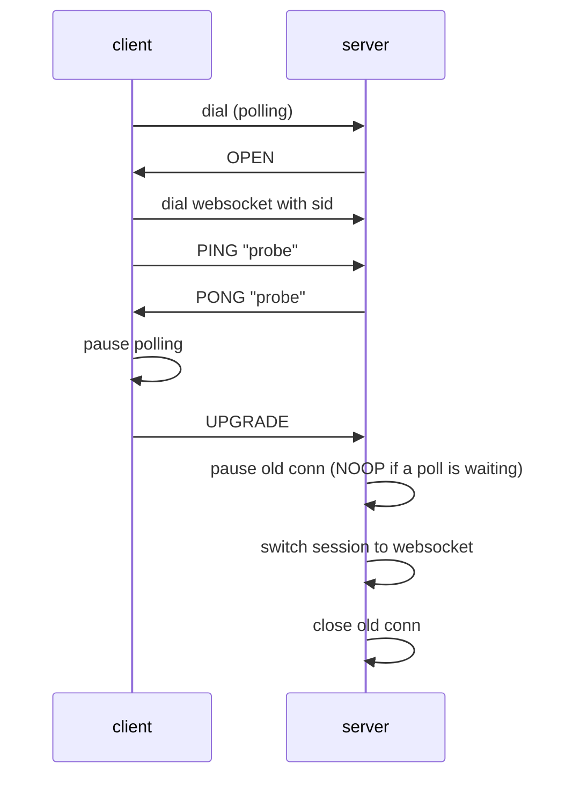

# Protocol support

This file owns the protocol facts: what the current code implements, known deviations,
and the deltas planned for v2. Client version compatibility is summarised in
[README.md](../README.md#compatibility).

## Implemented: Engine.IO protocol v4

Package `engineio`. The handshake gate, the error bodies, the polling payload and the
WebSocket framing are v4. The heartbeat and the `maxPayload` of the open packet are still
the v3 behaviour listed below until PR D1 (server ping ticker) lands; that PR flips them.

- Query parameter `EIO` must be `4` on every request, checked before the transport: a
  missing or any other value is HTTP 400 with the error body below, code 5, and a
  `engineio: request rejected` record with `reason="bad eio"`. The Go client
  (`engineio/client`) sends `EIO=4`, replacing any `EIO` in the URL it is given.
- Transports: `polling` (XHR only; the `j` JSONP parameter and the `b64` parameter are
  ignored, as in Engine.IO v4) and `websocket` (`gobwas/ws`). Order and upgrade path come from `engineio.Options.Transports`,
  default `[polling, websocket]`.
- Handshake (`OPEN` packet) carries `sid`, `upgrades`, `pingInterval` (default 20 s),
  `pingTimeout` (default 60 s). There is no `maxPayload`.
- Heartbeat (pending PR D1, still the v3 exchange): the client sends `PING` (`2`), the server answers `PONG` (`3`) and extends
  the read/write deadline by `pingTimeout`.
- Polling payload (Engine.IO v4 framing, ahead of the rest of this section): packets are
  separated by the record separator `0x1e`; binary packets are base64 behind a `b`
  prefix; every body is `text/plain; charset=UTF-8`, and a POST of `application/octet-stream`
  is HTTP 400. A POST body is read up to the transport's `MaxPayload` (default 1 MiB,
  `polling.Transport.MaxPayload`) before it is decoded: an announced or actual size over it is
  HTTP 413 and delivers nothing; a malformed body is HTTP 400, delivers nothing and ends
  the session. The server does not limit its responses: a response carries every packet the
  session writers hand over at once. The Go client reads a response (and the open
  response) up to the same `MaxPayload`; a longer one fails the session with
  `payload.ErrTooLarge`, which readers see. The client batches its POSTs up to the
  `maxPayload` of the open packet, and up to its `MaxPayload` (default 1 MiB) while the
  open packet carries none, as this server's does today. Sessions are looked up by `sid`; an unknown `sid` is HTTP 400.
- WebSocket framing (Engine.IO v4, ahead of the rest of this section): one packet per data
  message. A text message is the type byte and the data; a binary message is the raw data of
  a MESSAGE packet with no type byte, and the text form `b` + base64 is read as a binary
  MESSAGE. The server hijacks the HTTP/1.1 request (`ws.UpgradeHTTP`); a response writer
  that is not an `http.Hijacker`, as with HTTP/2, is answered with HTTP 501 and logged as
  `engineio: request rejected` with `reason="no hijacker"`. No extension is negotiated, so
  `permessage-deflate` is not supported, and no subprotocol is selected by the server. A
  message is limited to the transport's `MaxPayload` (default 1 MiB,
  `websocket.Transport.MaxPayload`), the fragments of one message together, checked before
  they are buffered. The peer is told why it is cut off with a close frame, then the TCP
  connection is half-closed, drained for at most one second and closed (a `Close` by the consumer in between marks the connection closed but leaves the socket to the drain): status 1009 for an oversized message, 1007 for invalid UTF-8 and
  1002 for a framing violation (unmasked client frame, reserved bits or opcode, a stray
  continuation) or an invalid Engine.IO packet (empty text, unknown type byte, malformed
  base64). A received close frame is answered with its status and closes the connection. Ping
  and pong control frames, also between fragments, are answered by the transport and are
  not Engine.IO packets. A handshake rejected by the origin check (`CheckOrigin`, by default
  same origin) is HTTP 403. The WebSocket `Proxy` hook supports `http` proxies through
  CONNECT only.
- Upgrade polling → websocket:

  Implemented in `session.Session.upgrading`. If the client never sends `UPGRADE`, the
  paused polling connection is resumed.
- Error responses of the handshake gate and of session lookup are JSON,
  `{"code":N,"message":"..."}` with `Content-Type: application/json`, as in the Engine.IO
  v4 specification:

  | Code | Message | Status | Answered for |
  | --- | --- | --- | --- |
  | 0 | `Transport unknown` | 400 | `transport` is not a configured transport |
  | 1 | `Session ID unknown` | 400 | `sid` names no session |
  | 2 | `Bad handshake method` | 400 | a request without `sid` that is not GET (OPTIONS still reaches the polling transport, which answers the CORS preflight) |
  | 3 | `Bad request` | 400 | an upgrade the transport order does not allow, a failed session initialisation, an HTTP method polling does not serve |
  | 4 | `Forbidden` | 403 | `RequestChecker` returned an error |
  | 5 | `Unsupported protocol version` | 400 | `EIO` missing or not `4` |

  Still plain text: HTTP 502 for a transport accept failure, HTTP 501 for a websocket
  upgrade on a response writer that cannot be hijacked, the polling body errors (HTTP 400
  content type, HTTP 413, malformed payload) and the polling GET HTTP 500 whose body is
  the error text. The polling GET 500 and the polling invalid-method 400 are logged as
  `engineio: request rejected` with `reason` `flush` and `bad method`; `flush` is DEBUG when
  the connection was closed or the payload had already failed with the same error, WARN
  otherwise. The full `reason` list is owned by `docs/OBSERVABILITY.md` (stage 2.4).

## Implemented: Socket.IO protocol v4

Branch `v1.x` only: the root package and `parser` (`parser.Buffer`, `Header.Query`).
Stage 2.0 removed the v1 root runtime from `master` and stage 2.3P replaced the v4
codec in `parser` there with the v5 codec (next section), so nothing in this section
and in the deviations after it describes `master`.

- Packet format `<type>[<attachments>-][<namespace>,][<ack id>][JSON]`. Types
  0 CONNECT, 1 DISCONNECT, 2 EVENT, 3 ACK, 4 ERROR, 5 BINARY_EVENT, 6 BINARY_ACK.
- On a new session the server connects the client to the root namespace `/`
  automatically and sends `0` before any client packet. Other namespaces are joined
  when the client sends `0/<nsp>`.
- Binary attachments are replaced by `{"_placeholder":true,"num":N}` and sent as
  following binary frames; on the Go side they map to `parser.Buffer`.
- Event handlers return values become the ACK payload; an ACK packet is sent when the
  handler returns values or the client requested an ack. Emitting with a trailing
  function argument registers an ack callback.
- Namespace query strings (`0/nsp?x=1`) are parsed into `Header.Query` and ignored.

## Known deviations from the v3/v4 specs

- No `maxPayload` handshake field is sent yet (the client reads it when present), and
  the websocket message limit is the transport's default 1 MiB, not the advertised value. The
  polling POST limit and the websocket limit are above.

Socket.IO v4 runtime, branch `v1.x` only (stage 2.0 removed the runtime from `master`):

- CONNECT to a namespace without a registered handler closes the connection instead
  of answering with an ERROR packet.
- `Header.Query` is never exposed to handlers.

## Implemented on master: Socket.IO protocol v5 wire codec

Package `parser`, stage 2.3P. It converts packets to and from the wire format and has
no runtime: nothing in the root package calls it before stage 2.3S. The wire format is
that of `socket.io-parser` 4.2.7 (protocol 5), checked against it by the Node oracle in
`parser/testdata/oracle` (run by hand, see its README; CI does not run it).

- A message is one text frame, the envelope, followed by as many binary frames as the
  envelope announces. The envelope is `<type>[<attachments>-][<namespace>,][<ack id>][JSON]`.
  Types on the wire: 0 CONNECT, 1 DISCONNECT, 2 EVENT, 3 ACK, 4 CONNECT_ERROR,
  5 BINARY_EVENT, 6 BINARY_ACK. `parser.Type` holds 0 to 4 only; an EVENT or ACK with
  attachments is written as 5 or 6.
- Binary values are replaced in the JSON by `{"_placeholder":true,"num":N}` and sent as
  the following binary frames, in order.

Deliberate differences from the Node.js parser:

- Missing EVENT, ACK or CONNECT_ERROR data is rejected, although Node's decoder
  accepts an absent payload. CONNECT may omit data; DISCONNECT must omit it.
- A namespace in a header must start with `/` and end its header with a comma, and
  contains no comma, NUL, CR or LF. The default namespace is returned as `/`.
- Attachment counts are unsigned decimal digits and positive; `1.0` and `1e0` are
  rejected, and so is a count of zero, as by 4.2.7.
- An acknowledgement ID above 2^53-1 is rejected. Leading zeros are accepted and
  written canonically.
- A placeholder index must be an integer name of an attachment; a fractional index
  is rejected where Node yields an undefined attachment value.
- Envelopes must be valid UTF-8 and valid JSON of bounded depth. The attachment
  count, byte and depth limits are checked here; Node's decoder waits for missing
  attachments instead of failing, so the `Assembler` adds a deadline.
- Unreferenced attachments and repeated placeholder indices are accepted, as by
  Node; each decoded reference owns its bytes where Node shares one buffer. Because
  that multiplies memory, `JSON[T]` decoding counts every reference, repeated ones
  included, against `Limits.MaxEventBytes` and returns `ErrTooLarge` past it.
- JSON decoding replaces an unpaired UTF-16 surrogate escape in a string by U+FFFD
  when a value is decoded into a Go string; the raw `Packet.Data` keeps the escape.

## Planned: Engine.IO v4 and Socket.IO v5

Target of [ROADMAP.md](ROADMAP.md#stage-2-socketio-protocol-v5-over-engineio-protocol-v4-tag-v200).

Engine.IO v3 → v4:

| Area | v3 | v4 (state) |
| --- | --- | --- |
| Query | `EIO` ignored | `EIO=4` required, otherwise HTTP 400 with JSON error code 5 (done, see above) |
| Handshake | `sid`, `upgrades`, `pingInterval`, `pingTimeout` | plus `maxPayload` (pending PR D1) |
| Heartbeat | client sends `2`, server answers `3` | server sends `2` every `pingInterval`, client answers `3` within `pingTimeout` (pending PR D1; the code is still v3) |
| WebSocket | one packet per frame, binary frames start with a type byte | unchanged; binary frames carry raw bytes (done, see above) |
| Upgrade | `2probe` / `3probe` / `5` | unchanged, plus server sends `6` (NOOP) into the pending poll |
| Errors | plain text | JSON `{"code": N, "message": "..."}`, codes 0..5 (done for the handshake gate and session lookup, see above) |

Socket.IO v4 → v5:

| Area | v4 (branch `v1.x`) | v5 (target; the wire codec is on `master`, see above) |
| --- | --- | --- |
| Root namespace | server connects `/` automatically | client must send `0`; server replies `0{"sid":"..."}` |
| Socket id | equals the engine `sid` | separate id per (connection, namespace) |
| CONNECT payload | none | optional JSON auth object: `0/admin,{"token":"abc"}` |
| Connection error | type 4 ERROR, string | type 4 CONNECT_ERROR, object `{"message","data"}` |
| DISCONNECT | `1/nsp` | `1/nsp,` |
| Binary attachments | placeholder objects | unchanged |
| Connection state recovery | none | `pid`/`offset` in CONNECT; out of scope, answered without recovery |

Not planned: EIO=3 in v2, WebTransport, permessage-deflate, connection state recovery.
