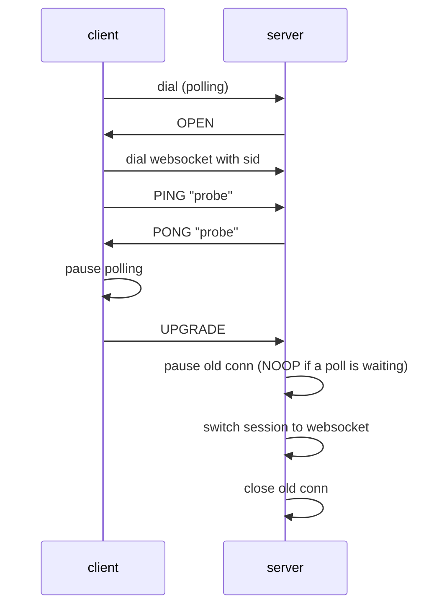

# Protocol support

This file owns the protocol facts: what the current code implements, known deviations,
and the deltas planned for v2. Client version compatibility is summarised in
[README.md](../README.md#compatibility).

## Implemented: Engine.IO protocol v3

Package `engineio`.

- Query parameter `EIO` is not checked; the server behaves as protocol v3 regardless.
- Transports: `polling` (XHR and JSONP via the `j` query parameter) and `websocket`
  (`gorilla/websocket`). Order and upgrade path come from `engineio.Options.Transports`,
  default `[polling, websocket]`.
- Handshake (`OPEN` packet) carries `sid`, `upgrades`, `pingInterval` (default 20 s),
  `pingTimeout` (default 60 s). There is no `maxPayload`.
- Heartbeat: the client sends `PING` (`2`), the server answers `PONG` (`3`) and extends
  the read/write deadline by `pingTimeout`.
- Polling payload: packets are length-prefixed (`<length>:<packet>`), lengths count
  UTF-16 code units; binary packets are base64 with a `b` prefix. Sessions are looked up
  by `sid`; an unknown `sid` is HTTP 400.
- Upgrade polling → websocket:

  Implemented in `session.Session.upgrading`. If the client never sends `UPGRADE`, the
  paused polling connection is resumed.
- Error responses are plain text with HTTP 400 (bad transport, bad sid) or 502
  (request checker or transport accept failure).

## Implemented: Socket.IO protocol v4

Branch `v1.x` only: the root package and `parser` (`parser.Buffer`, `Header.Query`).
Stage 2.0 removed the v1 root runtime from `master` and stage 2.3P replaced the v4
codec in `parser` there with the v5 codec (next section), so nothing in this section
and in the deviations after it describes `master`.

- Packet format `<type>[<attachments>-][<namespace>,][<ack id>][JSON]`. Types
  0 CONNECT, 1 DISCONNECT, 2 EVENT, 3 ACK, 4 ERROR, 5 BINARY_EVENT, 6 BINARY_ACK.
- On a new session the server connects the client to the root namespace `/`
  automatically and sends `0` before any client packet. Other namespaces are joined
  when the client sends `0/<nsp>`.
- Binary attachments are replaced by `{"_placeholder":true,"num":N}` and sent as
  following binary frames; on the Go side they map to `parser.Buffer`.
- Event handlers return values become the ACK payload; an ACK packet is sent when the
  handler returns values or the client requested an ack. Emitting with a trailing
  function argument registers an ack callback.
- Namespace query strings (`0/nsp?x=1`) are parsed into `Header.Query` and ignored.

## Known deviations from the v3/v4 specs

Branch `v1.x`.

- No `maxPayload` handshake field and no payload size limit.
- CONNECT to a namespace without a registered handler closes the connection instead
  of answering with an ERROR packet.
- `Header.Query` is never exposed to handlers.

## Implemented on master: Socket.IO protocol v5 wire codec

Package `parser`, stage 2.3P. It converts packets to and from the wire format and has
no runtime: nothing in the root package calls it before stage 2.3S. The wire format is
that of `socket.io-parser` 4.2.7 (protocol 5), checked against it by the Node oracle in
`parser/testdata/oracle` (run by hand, see its README; CI does not run it).

- A message is one text frame, the envelope, followed by as many binary frames as the
  envelope announces. The envelope is `<type>[<attachments>-][<namespace>,][<ack id>][JSON]`.
  Types on the wire: 0 CONNECT, 1 DISCONNECT, 2 EVENT, 3 ACK, 4 CONNECT_ERROR,
  5 BINARY_EVENT, 6 BINARY_ACK. `parser.Type` holds 0 to 4 only; an EVENT or ACK with
  attachments is written as 5 or 6.
- Binary values are replaced in the JSON by `{"_placeholder":true,"num":N}` and sent as
  the following binary frames, in order.

Deliberate differences from the Node.js parser:

- Missing EVENT, ACK or CONNECT_ERROR data is rejected, although Node's decoder
  accepts an absent payload. CONNECT may omit data; DISCONNECT must omit it.
- A namespace in a header must start with `/` and end its header with a comma, and
  contains no comma, NUL, CR or LF. The default namespace is returned as `/`.
- Attachment counts are unsigned decimal digits and positive; `1.0` and `1e0` are
  rejected, and so is a count of zero, as by 4.2.7.
- An acknowledgement ID above 2^53-1 is rejected. Leading zeros are accepted and
  written canonically.
- A placeholder index must be an integer name of an attachment; a fractional index
  is rejected where Node yields an undefined attachment value.
- Envelopes must be valid UTF-8 and valid JSON of bounded depth. The attachment
  count, byte and depth limits are checked here; Node's decoder waits for missing
  attachments instead of failing, so the `Assembler` adds a deadline.
- Unreferenced attachments and repeated placeholder indices are accepted, as by
  Node; each decoded reference owns its bytes where Node shares one buffer.
- JSON decoding replaces an unpaired UTF-16 surrogate escape in a string by U+FFFD
  when a value is decoded into a Go string; the raw `Packet.Data` keeps the escape.

## Planned: Engine.IO v4 and Socket.IO v5

Target of [ROADMAP.md](ROADMAP.md#stage-2-socketio-protocol-v5-over-engineio-protocol-v4-tag-v200).

Engine.IO v3 → v4:

| Area | v3 (current) | v4 (target) |
| --- | --- | --- |
| Query | `EIO` ignored | `EIO=4` required, otherwise HTTP 400 with JSON error code 5 |
| Handshake | `sid`, `upgrades`, `pingInterval`, `pingTimeout` | plus `maxPayload` |
| Heartbeat | client sends `2`, server answers `3` | server sends `2` every `pingInterval`, client answers `3` within `pingTimeout` |
| Polling payload | `<length>:<packet>` | packets separated by `\x1e` (record separator) |
| Polling binary | `b` + base64 with length | `b` + base64, no length |
| WebSocket | one packet per frame | unchanged; binary frames carry raw bytes |
| Upgrade | `2probe` / `3probe` / `5` | unchanged, plus server sends `6` (NOOP) into the pending poll |
| Errors | plain text | JSON `{"code": N, "message": "..."}`, codes 0..5 |

Socket.IO v4 → v5:

| Area | v4 (current) | v5 (target) |
| --- | --- | --- |
| Root namespace | server connects `/` automatically | client must send `0`; server replies `0{"sid":"..."}` |
| Socket id | equals the engine `sid` | separate id per (connection, namespace) |
| CONNECT payload | none | optional JSON auth object: `0/admin,{"token":"abc"}` |
| Connection error | type 4 ERROR, string | type 4 CONNECT_ERROR, object `{"message","data"}` |
| DISCONNECT | `1/nsp` | `1/nsp,` |
| Binary attachments | placeholder objects | unchanged |
| Connection state recovery | none | `pid`/`offset` in CONNECT; out of scope, answered without recovery |

Not planned: EIO=3 in v2, WebTransport, permessage-deflate, connection state recovery.
